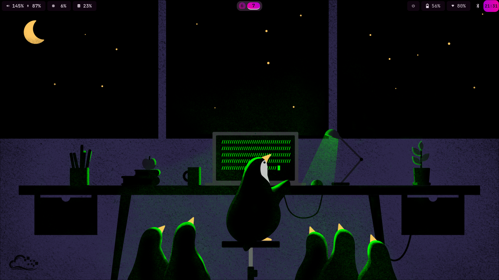

# My NixOS Dotfiles

This repository contains my personal NixOS, nix-darwin and Home-Manager configurations, managed as a [Nix flake](https://nixos.wiki/wiki/Flakes).
It provides a declarative and reproducible way to manage my system configurations across different machines.
Easy to add hosts that run NixOS, nix-darwin or a standalone Home-Homemanager instance on (non-)NixOS.
Uses `flake-parts` to seperate the flake outputs to different host modules.

## Screenshot



## Structure

The repository is structured as follows:

-   `flake.nix`: The entry point for the flake, defining inputs and outputs.
-   `hosts/`: Contains machine-specific configurations. Each host has a `default.nix` that defines the NixOS configuration for that machine, and a `users` directory for user-specific configurations.
    -   `ideapad/`: Configuration for my Ideapad laptop.
    -   `nixberry/`: Configuration for my Raspberry Pi.
    -   `surface/`: Configuration for my Surface device, which uses home-manager standalone.
-   `modules/`: Contains reusable modules for configuring different aspects of the system.
    -   `core/`: Core modules shared between NixOS and nix-darwin.
    -   `darwin/`: Modules specific to nix-darwin.
    -   `hm-standalone/`: Modules for home-manager standalone.
    -   `home/`: Home Manager modules for user-specific configurations.
    -   `nixos/`: NixOS specific modules, now further modularized into files like `boot.nix`, `sound.nix`, etc.
-   `profiles/`: Defines different profiles that can be applied to hosts or users.
    -   `system/`: System-level profiles.
    -   `user/`: User-level profiles.
-   `lib/`: Contains helper functions, like `mkUser.nix` for creating users.
-   `secrets/`: Contains secrets managed by `sops-nix`.

## Installation and Usage

To use these dotfiles, you will need Nix installed with flake support enabled.

**Warning:** These are my personal dotfiles and are highly customized. Use them at your own risk and adapt them to your needs.

1.  **Clone the repository:**
    ```bash
    git clone https://github.com/pieterpel/dotfiles.git ~/dotfiles
    cd ~/dotfiles
    ```

2.  **Customize the configuration:**
    You will likely need to edit the files in `hosts/` to match your hardware and user setup. For a new NixOS host, you would typically add a new directory under `hosts/` and include your machine's `hardware-configuration.nix`.

3.  **Apply the configuration:**

    ### NixOS
    To build a NixOS configuration, run:
    ```bash
    sudo nixos-rebuild switch --flake .#<hostname>
    ```
    Where `<hostname>` is one of the hosts defined in `hosts/` (e.g., `ideapad`, `nixberry`).

    ### Home Manager Standalone
    To build a home-manager standalone configuration, run:
    ```bash
    home-manager switch --flake .#<username>
    ```
    Where `<username>` is a user with a home-manager standalone configuration (e.g., `pieterpel`).

    ### nix-darwin
    This configuration also supports `nix-darwin`. To build a `nix-darwin` configuration, you would add a new host in the `hosts` directory and use `inputs.nix-darwin.lib.darwinSystem` to create the configuration. Then, you can apply it by running:
    ```bash
    darwin-rebuild switch --flake .#<darwin-hostname>
    ```

## Secrets

This repository uses `sops-nix` to manage secrets. The secrets are encrypted and stored in the `secrets/` directory. See the `sops-nix` documentation for more information on how to use it.

## Contributing

Feel free to open issues or pull requests if you have suggestions or improvements.
